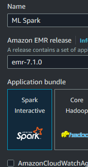

## AWS EMR Cluster for Wine Quality Prediction

This is a Wine Quality Prediction project using an AWS EMR Cluster with 1 core and 4 workers. The project uses Python, Java, and Docker. Python libraries are pyspark, numpy, pandas, and findspark.

## Making the AWS EMR Cluster

On the AWS Console, navigate to **EMR**.


Click **Create Cluster**


Name your cluster and click **Spark Interactive Application Bundle**



Leave Cluster Configuration Default
Under **Cluster scaling and provisioning**, change Task-1 Instance(s) size to 4


Under **Cluster termination and node replacement**, change Termination option to Manually terminate cluster


Under Security configuration and EC2 key pair, Create a key pair and use that one to access the EMR Cluster Core


Under Identiy and Access Management (IAM) roles, change **Service** role to *EMR_DefaultRole*, **Instance** profile to *EMR_EC2_DefaultRole*, and **Custom Automatic Scaling Role** to *EMR_AutoScaling_DefaultRole*


Hit Create Cluster.

Navigate to the first EC2 instance created after the cluster is created.


Click the group under Security groups. Click Edit inbound rules.
Add rule: SSH MyIP

Connect to the EC2 Instance using the key generated.

## Training the Model

After accessing the EMR Core EC2 Instance (user ec2-user), copy and paste the code in this github to the EC2 Instance File system.
Install the python requirements.
```
pip install -r requirements.txt
```
```
hadoop fs -put TrainingDataset.csv
```
```
hadoop fs -put ValidationDataset.csv
```
Run this command to generate the model under Modelfile folder.
```
spark-submit  modelTraining.py
```
The modelfile has been pushed to docker and is used in the main test for docker file.

## Predicting with the Model without Docker

In an EC2 instance with the files located in this github or docker, run the command:
The EC2 Instance needs to have the python file, requirements, and modelfile.
```
spark-submit  modelTesting.py ValidationDataset.csv
```
Replace ValidationDataset.csv with any file that works with this dataset.
This generates a model.txt that contains the F1 score.

## Predicting with the Model with Docker

In any machine run the following commands:
```
sudo  yum  install  docker  -y
```
```
sudo  systemctl  start  docker
```
```
sudo  docker  pull  pendon/mlspark:latest
```
```
sudo docker run pendon/mlspark:latest ValidationDataset.csv
```
The model.txt output will be located inside the container. The output will also be printed in the cmd prompt.
